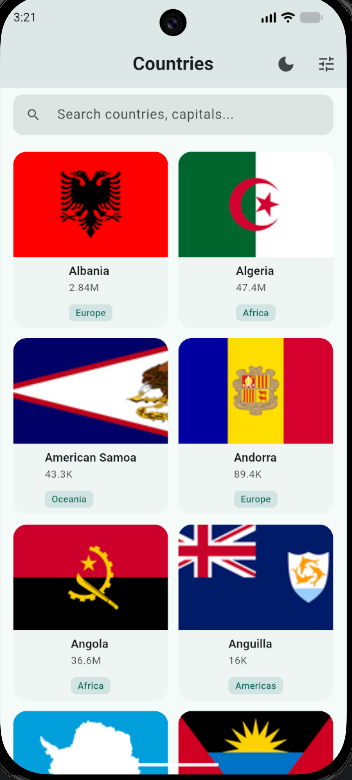
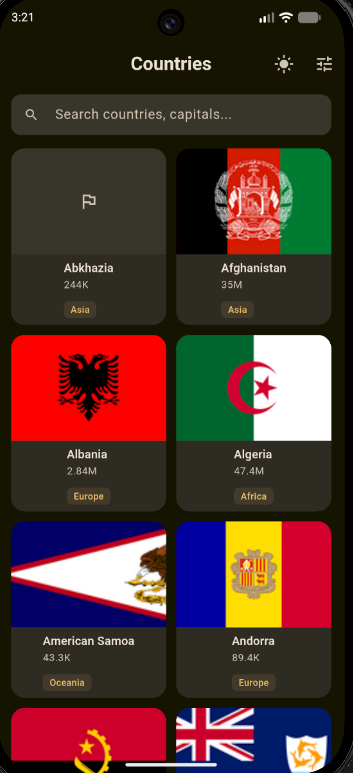
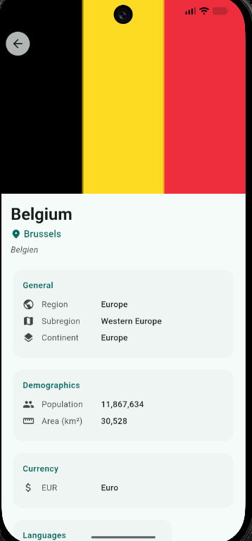
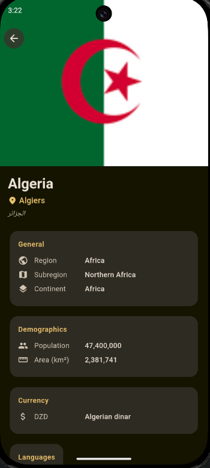
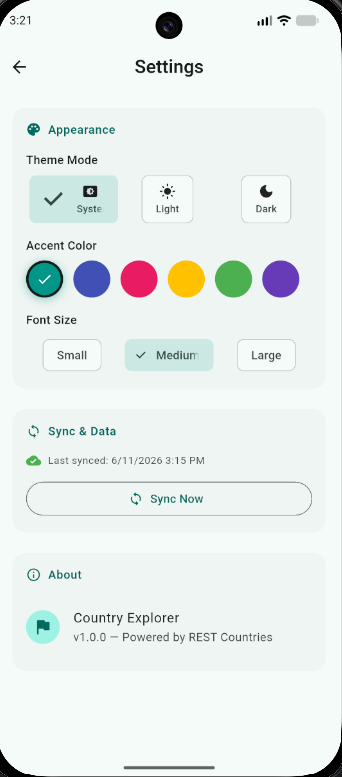

# Country Explorer

A Flutter app that browses countries with dynamic theming, offline support, and real-time sync.

## Screenshots

<p align="center">
  
  
  
  
  
</p>

## Features

- Browse countries with search and infinite scroll
- Country detail view with flag, map, and stats
- Offline-first — caches data locally via Hive
- Sync data on demand
- Dynamic theming (light/dark mode, 6 accent colors, 3 font scales)
- Real-time connectivity indicator with offline banner
- Pull-to-refresh
- Shimmer loading placeholders

## Architecture

Clean Architecture with 3 layers:

```
lib/
├── core/           # Shared utilities
│   ├── constants/  # App constants, API config
│   ├── network/    # Dio HTTP client, connectivity service
│   ├── router/     # GoRouter route definitions
│   └── theme/      # Theme data builders & Riverpod provider
├── data/           # Data layer
│   ├── datasources/ # Remote (API) & Local (Hive) sources
│   ├── models/     # JSON-serializable models (extend entities)
│   └── repositories/ # Repository implementations
├── domain/         # Business logic layer
│   ├── entities/   # Pure Dart domain objects
│   └── repositories/ # Abstract repository contracts
└── presentation/   # UI layer
    ├── countries/  # List & detail screens
    ├── providers/  # Riverpod state providers
    ├── settings/   # Settings screen
    └── widgets/    # Reusable widgets
```

## Tech Stack

| Tool | Purpose |
|---|---|
| **Riverpod** | State management — `AsyncNotifier`, `Notifier`, `StateNotifier`, `Provider`, `FutureProvider`, `StreamProvider` |
| **Dio** | HTTP client with logging interceptor |
| **Hive** | Local key-value storage for offline caching |
| **Connectivity Plus** | Real-time network status monitoring |
| **Cached Network Image** | Image loading with disk caching |
| **Flutter Animate** | Smooth animations |
| **Shimmer** | Loading placeholder effects |
| **GoRouter** | Declarative routing |
| **Intl** | Number and date formatting |

## State Management (Riverpod)

- **`CountryListNotifier`** (`AsyncNotifier`) — fetches countries from API or cache. Exposes loading/data/error states.
- **`AppThemeNotifier`** (`Notifier`) — manages theme mode, accent color, and font scale. Derived providers (`lightThemeProvider`, `darkThemeProvider`) rebuild theme data reactively.
- **`SyncNotifier`** (`Notifier`) — tracks sync status and last sync time.
- **`connectivityProvider`** (`StreamProvider`) — streams connectivity changes.
- **`isOnlineProvider`** (`FutureProvider`) — one-shot connectivity check.

### Data Flow

```
UI (read/watch providers)
  → AsyncNotifier / Notifier
    → Repository (abstract in domain, impl in data)
      → RemoteDataSource (Dio → API)
      → LocalDataSource (Hive for cache)
```

On app launch, `CountryListNotifier.build()` checks connectivity:
- **Online**: fetches from API, caches result via `CountryLocalDataSource`.
- **Offline**: returns cached Hive data. Shows offline banner.

## Getting Started

### Prerequisites

- Flutter SDK ^3.11.5
- Dart ^3.11.5

### Setup

```bash
git clone <repo-url>
cd rayar_flutter_app
flutter pub get
flutter run
```

### Build

```bash
flutter build apk       # Android
flutter build ios       # iOS
flutter build web       # Web
```

## Project Structure

```
rayar_flutter_app/
├── android/
├── ios/
├── lib/
│   ├── core/
│   │   ├── constants/
│   │   │   └── app_constants.dart
│   │   ├── network/
│   │   │   ├── api_client.dart
│   │   │   └── connectivity_service.dart
│   │   ├── router/
│   │   │   └── app_router.dart
│   │   └── theme/
│   │       ├── app_theme.dart
│   │       └── theme_provider.dart
│   ├── data/
│   │   ├── datasources/
│   │   │   ├── country_local_datasource.dart
│   │   │   └── country_remote_datasource.dart
│   │   ├── models/
│   │   │   └── country_model.dart
│   │   └── repositories/
│   │       └── country_repository_impl.dart
│   ├── domain/
│   │   ├── entities/
│   │   │   └── country.dart
│   │   └── repositories/
│   │       └── country_repository.dart
│   ├── presentation/
│   │   ├── countries/
│   │   │   ├── country_detail_screen.dart
│   │   │   └── country_list_screen.dart
│   │   ├── providers/
│   │   │   ├── country_providers.dart
│   │   │   └── sync_provider.dart
│   │   ├── settings/
│   │   │   └── settings_screen.dart
│   │   └── widgets/
│   │       ├── country_card.dart
│   │       ├── offline_banner.dart
│   │       ├── rebuild_counter.dart
│   │       └── shimmer_loading.dart
│   └── main.dart
├── test/
│   └── widget_test.dart
├── screenshots/
├── pubspec.yaml
└── README.md
```
